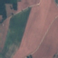
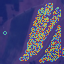
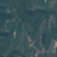
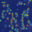

# 🌍 GeoXAI-EuroSAT

> Explainable AI for Satellite Image Classification using Grad-CAM and Multimodal LLMs

---

## Project Overview

This project explores **Explainable AI (XAI)** for satellite image classification using the [EuroSAT RGB dataset](https://github.com/phelber/EuroSAT).  
First, I trained a CNN to classify land-use images and used **Grad-CAM** to visualize the model's spatial focus.  
Then, I used a **multimodal LLM via OpenRouter** to generate human-readable explanations for each classification decision.

---

## Dataset: EuroSAT RGB

- ✅ 10 land use classes (e.g., Forest, AnnualCrop, Highway)
- 🖼️ 27,000+ RGB images (64×64 pixels)
- 📁 Used only RGB bands for classification

## Sample Results

Below are examples of model decisions explained using Grad-CAM and LLMs.  
Each row includes:
- The **original satellite image**
- The **Grad-CAM heatmap**
- The **LLM-generated explanation**

---

### ✅ Correct Prediction — *AnnualCrop*

| Original                                                                         | Grad-CAM | LLM Explanation |
|----------------------------------------------------------------------------------|----------|-----------------|
|  |  | *The model concentrates on the linear, segmented patterns consistent with crop rows and mechanical tillage — visual cues characteristic of annual agricultural fields. This structured spatial regularity supports the correct classification as 'AnnualCrop'.* |

---

### ❌ Incorrect Prediction — *HerbaceousVegetation → Permanent Crop*

| Original | Grad-CAM | LLM Explanation                                                                                                                                                            |
|----------|----------|----------------------------------------------------------------------------------------------------------------------------------------------------------------------------|
|  |  | *The model appears to focus on the repeated, structured vegetation patches that resemble cultivated fields. These regular spatial patterns likely misled the model into predicting 'Permanent Crop' instead of the more naturally distributed textures typically associated with 'Herbaceous Vegetation'.* |

